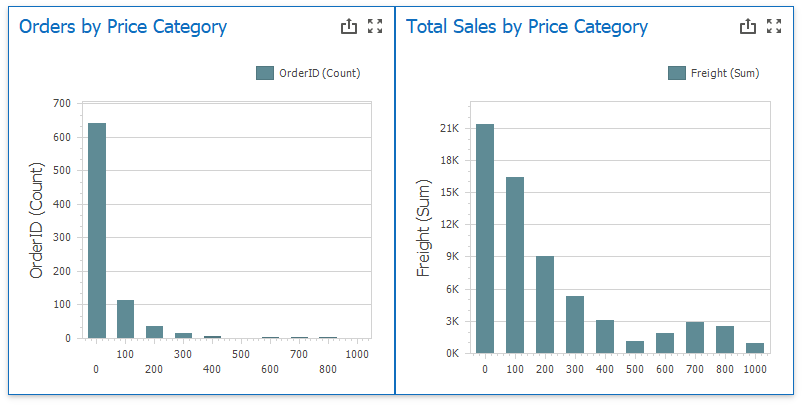

<!-- default file list -->
*Files to look at*:

* [Form1.cs](./CS/Dashboard_NumericGroupInterval/Form1.cs) ([Form1.vb](./CS/Dashboard_NumericGroupInterval/Form1.vb))
* [GetNumericGroupIntervalFunction.cs](./CS/Dashboard_NumericGroupInterval/GetNumericGroupIntervalFunction.cs) ([GetNumericGroupIntervalFunction.vb](./VB/Dashboard_NumericGroupInterval/GetNumericGroupIntervalFunction.vb))
* [Program.cs](./CS/Dashboard_FiscalFunctions/Program.cs#L24) ([Program.vb](./VB/Dashboard_FiscalFunctions/Program.vb#L24))
<!-- default file list end -->
# Dashboard for WinForms - How to Calculate the Numeric Group Interval

This example shows how to add a custom function in a client mode. The function allows you to group data by the specified criterion in the WinForm dashboard.

## Overview

In this example, the _Orders by Price Category_ [chart](https://docs.devexpress.com/Dashboard/14719/winforms-dashboard/winforms-designer/create-dashboards-in-the-winforms-designer/dashboard-item-settings/chart) dashboard item displays the number of orders for each price category and the _Total Sales by Price Categoty_ chart displays total sales for each price category.



The following expression calculates price categories:

| Calculated Field| Expression |
| --- | --- |
| Price Category | ``` GetNumericGroupInterval([Freight], 100) ``` |

Call the [CriteriaOperator.RegisterCustomFunction](https://docs.devexpress.com/CoreLibraries/DevExpress.Data.Filtering.CriteriaOperator.RegisterCustomFunction(DevExpress.Data.Filtering.ICustomFunctionOperator)) method to register a custom function in your project (see:  [Program.cs](./CS/Dashboard_FiscalFunctions/Program.cs#L24)/[Program.vb](./VB/Dashboard_FiscalFunctions/Program.vb#L24)). 
## Documentation

- [ICustomFunctionOperatorBrowsable](https://docs.devexpress.com/CoreLibraries/DevExpress.Data.Filtering.ICustomFunctionOperatorBrowsable)
- [ICustomFunctionOperatorFormattable](https://docs.devexpress.com/CoreLibraries/DevExpress.Data.Filtering.ICustomFunctionOperatorFormattable)
- [Expression Constants, Operators, and Functions](https://docs.devexpress.com/Dashboard/400122/common-features/advanced-analytics/expression-constants-operators-and-functions)
- [Grouping](https://docs.devexpress.com/Dashboard/116535/common-features/data-shaping/grouping)
